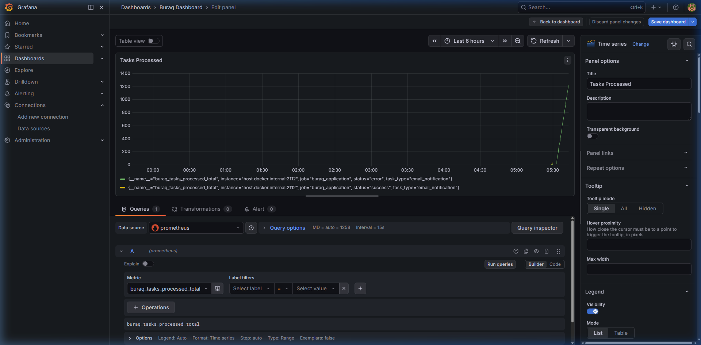

# Buraq Task Queue

Buraq is a highly concurrent, resilient distributed task queue built with Go and Redis Streams. It provides robust capabilities out of the box for handling asynchronous jobs, scaling workers, and managing failures seamlessly through retries and a Dead-Letter Queue (DLQ).



## Features

- **Concurrent Workers**: Spin up a pool of goroutines to process streams of work concurrently without blocking.
- **Resilience & Retries**: Automatically requeues failing tasks based on a configurable maximum retry limit.
- **Dead-Letter Queue (DLQ)**: Hard-failing tasks (poison pills) are automatically isolated to a specific DLQ stream for easy inspection.
- **Graceful Shutdown**: Intercepts `SIGINT` and `SIGTERM` to allow currently executing tasks to finish and halt the worker fetch-loop preventing ghost tasks.
- **Telemetry & Metrics**: Exposes HTTP Prometheus endpoints tracking task durations, total processed throughput, failure rates, and DLQ routing.
- **Redis Streams Backed**: Built upon Redis 5.0+ Streams utilizing `XADD`, `XREADGROUP`, and `XACK`.

## Project Structure

- `task/`: Core struct definition of a Task and its JSON serialization.
- `producer/`: Exposes functionality to reliably `XADD` jobs into the stream.
- `consumer/`: Exposes a worker pool that connects to the stream via Consumer Groups.
- `metrics/`: Centralized Prometheus metric collectors.
- `docs/`: In-depth architectural decisions, teaching guides, and usage benefits.

## Getting Started

### Prerequisites

- Go 1.20+
- Docker & Docker Compose (for local Redis/Prometheus/Grafana stack)

### Running Locally

1. **Spin up the Infrastructure:**
   ```bash
   docker-compose up -d
   ```
   This starts Redis (port 6379), Prometheus (port 9090), and Grafana (port 3000).

2. **Run the Buraq Go application:**
   ```bash
   go run main.go
   ```
   This will initialize a mocked producer queueing tasks and a consumer pool processing them.

3. **Check Metrics & Visualizations:**
   Navigate to `http://localhost:2112/metrics` to visualize raw Prometheus metrics emitting correctly.

   To visualize your data natively over time via Grafana, open `http://localhost:3000` (Login: `admin` / `admin`). Set up a Prometheus connection to `http://prometheus:9090`.

   **See a demo setup below:**
   

## Documentation

For a deep dive into the code configuration and reasoning, check out the `/docs` folder:
- [Architecture](docs/architecture.md)
- [Teaching Guide](docs/teaching_guide.md)
- [Usage & Benefits](docs/usage_and_benefits.md)

## Contributing

Please see [CONTRIBUTING.md](CONTRIBUTING.md) for details on how to get started contributing to Buraq!
