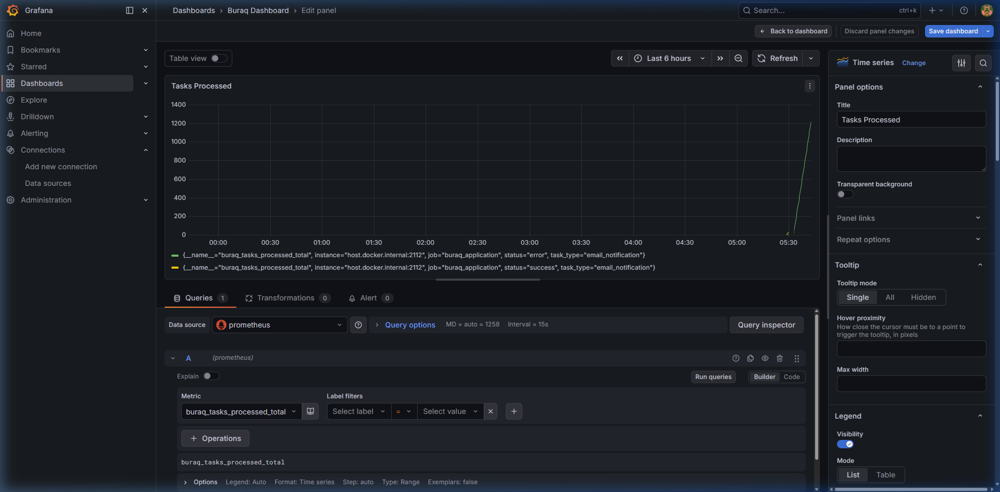

# Buraq Task Queue


Buraq is a highly concurrent, resilient distributed task queue built with **Go** and **Redis Streams**. It provides robust capabilities out of the box for handling asynchronous jobs, scaling workers, and managing failures seamlessly through automatic retries and a Dead-Letter Queue (DLQ).

If a worker crashes or fails, the task is automatically re-queued up to a configurable retry limit before being isolated to a dedicated Dead-Letter Queue (`buraq_tasks_dlq`) for inspection and manual replay.



---

## ✨ Features

| Feature | Description |
|---|---|
| **Concurrent Worker Pool** | Spin up a configurable pool of goroutines to process tasks in parallel without blocking. |
| **Automatic Retries** | Failing tasks are transparently re-queued up to a per-task `MaxRetries` limit. |
| **Dead-Letter Queue** | Poison-pill tasks that exhaust all retries are routed to an isolated DLQ stream for safe inspection. |
| **DLQ Replay** | Re-enqueue all DLQ tasks back into the main stream with a single API call — retries reset to zero. |
| **Graceful Shutdown** | Intercepts `SIGINT`/`SIGTERM`, stops the fetch loop, and lets in-flight workers drain cleanly before exiting. |
| **Real-Time Event Stream** | Server-Sent Events (SSE) endpoint broadcasts task lifecycle events (`Pending → Processing → Completed / Failed → DLQ`) via Redis Pub/Sub. |
| **Prometheus Metrics** | Exposes task throughput, failure rates, DLQ counts, and processing duration histograms at `/metrics`. |
| **Redis Streams Backed** | Built on Redis 5.0+ Streams using `XADD`, `XREADGROUP`, and `XACK` — persistent, ordered, and consumer-group-aware. |

---

## 📊 Performance

Benchmarked on a single node against a local Redis instance (AMD Ryzen 5 3600, Windows):

| Metric | Result |
|---|---|
| **Throughput** | **13,356 tasks/sec** (publish) |
| **p99 Enqueue Latency** | 582ms under 10,000 concurrent goroutines |
| **Workers** | 50 concurrent goroutines |
| **Tasks** | 10,000 concurrent enqueues |
| **Total Time** | ~0.75 seconds |

Run it yourself:

```bash
# Requires Redis running on localhost:6379
go test -v -run=^$ -bench=BenchmarkBuraqQueue -benchtime=1x ./internal/worker/
```

---

## 🏗 Architecture

```
Producer (XADD)
     │
     ▼
Redis Stream (buraq_tasks)
     │
     ▼
Consumer Group (XREADGROUP)
     │
     ├── Worker 1 ──► Process ──► XACK  ──► ✅ Success
     ├── Worker 2 ──► Process ──► Retry ──► Re-queue (up to MaxRetries)
     └── Worker N ──► Process ──► DLQ   ──► buraq_tasks_dlq
```

All task state transitions are published to a `buraq_events` Redis Pub/Sub channel, which the SSE API streams to connected clients in real time.

---

## 📁 Project Structure

```
buraq/
├── main.go              # Entry point: wires producer, consumer, API, and metrics
├── task/
│   └── task.go          # Task & Event struct definitions with JSON serialization
├── producer/
│   └── producer.go      # Enqueues tasks via XADD and publishes Pending events
├── consumer/
│   └── consumer.go      # Worker pool: fetches, processes, retries, and DLQs tasks
├── api/
│   └── server.go        # REST + SSE API server (port 8080)
├── metrics/
│   └── metrics.go       # Centralized Prometheus metric collectors
├── internal/worker/
│   ├── worker.go        # Alternative standalone worker implementation
│   └── bench_test.go    # Throughput & latency benchmark (10K concurrent tasks)
├── benchmarks/
│   └── benchmark_test.go # Producer-side benchmark
├── assets/
│   └── tasks_chart.png  # Dashboard screenshot
├── docker-compose.yml   # Redis + Prometheus + Grafana stack
└── prometheus.yml       # Prometheus scrape configuration
```

---

## 🚀 Getting Started

### Prerequisites

- **Go 1.24+**
- **Docker & Docker Compose** (for the local Redis / Prometheus / Grafana stack)

### 1. Start the Infrastructure

```bash
docker-compose up -d
```

This starts:
- **Redis** on `localhost:6379`
- **Prometheus** on `localhost:9090`
- **Grafana** on `localhost:3000` (login: `admin` / `admin`)

### 2. Run Buraq

```bash
go run main.go
```

This starts the mock task producer (one task every 2 seconds), the 5-worker consumer pool, the API server, and the Prometheus metrics server.

### 3. Observe

| Endpoint | Description |
|---|---|
| `http://localhost:2112/metrics` | Raw Prometheus metrics |
| `http://localhost:8080/api/stream` | SSE stream of real-time task events |
| `http://localhost:8080/api/workers` | JSON snapshot of current worker status |
| `http://localhost:9090` | Prometheus UI |
| `http://localhost:3000` | Grafana (set datasource to `http://prometheus:9090`) |

---

## 🔌 API Reference

### `GET /api/stream`
Server-Sent Events stream. Emits a JSON event for every task state change.

```
data: {"type":"Pending","task_id":"task-1","worker_id":""}
data: {"type":"Processing","task_id":"task-1","worker_id":"worker_node_1-3"}
data: {"type":"Completed","task_id":"task-1","worker_id":"worker_node_1-3"}
```

Event types: `Pending` · `Processing` · `Completed` · `Failed` · `DLQ`

### `GET /api/workers`
Returns a JSON array of current worker nodes with CPU and memory stats.

```json
[
  { "id": "worker_node_1-1", "cpu": 42.5, "memory": 312.8, "status": "active" }
]
```

### `POST /api/retry-dlq`
Moves all tasks in the DLQ back to the main stream with retries reset to zero.

```json
{ "success": true, "retried": 4 }
```

---

## 📚 Documentation

Deep-dive guides covering every concept in the project:

| Guide | What You'll Learn |
|---|---|
| [Architecture](docs/01_architecture.md) | Every component, data flow, and design decision explained |
| [Redis Streams](docs/02_redis_streams.md) | Complete mental model of XADD, XREADGROUP, XACK, PEL, and consumer groups |
| [Concurrency Patterns](docs/03_concurrency_patterns.md) | Worker pools, channels, WaitGroups, context cancellation, and the shutdown dance |
| [Reliability Patterns](docs/04_reliability_patterns.md) | DLQ, retry strategies, at-least-once delivery, and data loss prevention |
| [Building from Scratch](docs/05_building_from_scratch.md) | Step-by-step thinking process to build a task queue from zero |
| [Thinking Like an Engineer](docs/06_thinking_like_an_engineer.md) | Debugging strategies, mental models, code reading, and career growth |
| [Explaining to Anyone](docs/07_explaining_to_anyone.md) | How to communicate technical concepts to any audience |
| [Observability](docs/08_observability.md) | Prometheus, PromQL, Grafana dashboards, SSE, and structured logging |

---

## 🗺 Roadmap

- [ ] **Task Timeouts** — Auto-fail tasks that exceed a configurable execution deadline.
- [ ] **Cron / Delayed Jobs** — Schedule tasks for future execution or on a recurring interval.
- [ ] **Priority Queues** — Route high-priority tasks to a dedicated stream / consumer group.
- [ ] **Redis Cluster Support** — Shard streams across a Redis Cluster for horizontal scaling.

---

## 🤝 Contributing

Please see [CONTRIBUTING.md](CONTRIBUTING.md) for details on setting up your environment, making changes, and submitting a pull request.
